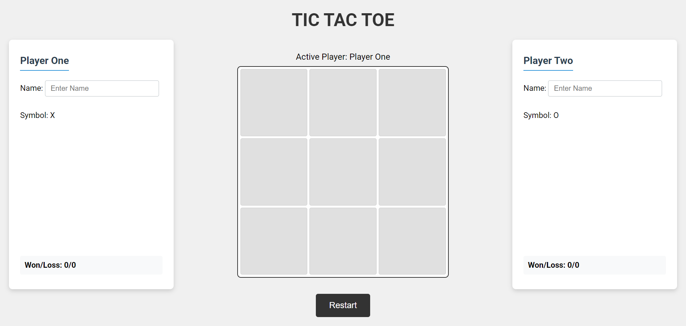
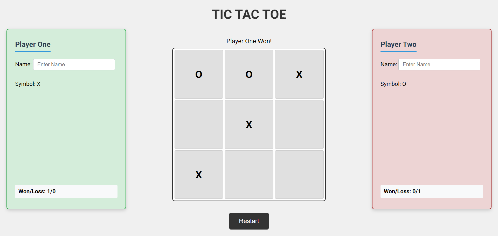

# Tic-Tac-Toe

## Overview  

A simple Tic-Tac-Toe game developed with **HTML, CSS, and JavaScript** as part of [The Odin Project](https://www.theodinproject.com/) curriculum. This project focuses on functionality and modularity over visual design. The game runs in the browser and includes full game logic, a dynamic UI, and proper win/loss tracking.

## Features

- **Two-player mode** – Players take turns automatically.
- **Win detection** – Automatically identifies wins, losses, and ties.
- **Dynamic UI updates** – The interface reflects real-time game progress.
- **Score tracking** – Displays player wins and losses across multiple games.
- **Restart feature** – Reset the board anytime with a single click.
- **Modular JavaScript** – Organized using the module pattern.

## How It Works

1. **Players alternate turns** – One selects "X," the other "O."
2. **Win/tie detection** – The game automatically checks for three-in-a-row or a draw.
3. **Real-time updates** – The UI displays results instantly.
4. **Score tracking** – Wins and losses persist across multiple games.
5. **Restart feature** – Reset the board anytime with a single click.

## Project Structure  

- `index.html` – Contains the game layout.
- `style.css` – Styles the game interface.
- `script.js` – Implements the game logic and UI updates.

## Technologies Used

- **HTML** – Structuring the game layout.
- **CSS** – Styling the game interface.
- **JavaScript (ES6)** – Game logic and interactivity.
- **Module Pattern** – Organized, modular JavaScript code.

## Future Enhancements  

- **AI Opponent** – Implement a single-player mode with different difficulty levels.  
- **Animations & Sound** – Improve user experience with engaging effects.  
- **UI Enhancements** – Apply modern styles for a polished look.  
- **Code Refactoring** – Optimize structure and improve maintainability.  

## Screenshots

- **Game Board** – The default layout of the Tic-Tac-Toe board.  
    

- **Winning Screen** – A snapshot of the UI when a player wins.  
    

## Live Demo  

[View on GitHub Pages](https://linzi-v7.github.io/tic-tac-toe/)  

## Acknowledgments  

- **The Odin Project** – For providing the curriculum and project inspiration.  

## License  

This project is licensed under the **MIT License**, meaning you are free to use, modify, and distribute it with attribution. Read the full terms [here](https://github.com/linzi-v7/tic-tac-toe/blob/main/LICENSE).  

## Contact  

Have feedback or want to collaborate? Feel free to connect:  

- **GitHub** – [linzi-v7](https://github.com/linzi-v7)  
- **LinkedIn** – [Faris Osama](https://www.linkedin.com/in/faris-osama-7a3496303/)  

---

### 📌 Project Status: **Completed** 🚀 (Future improvements planned)
